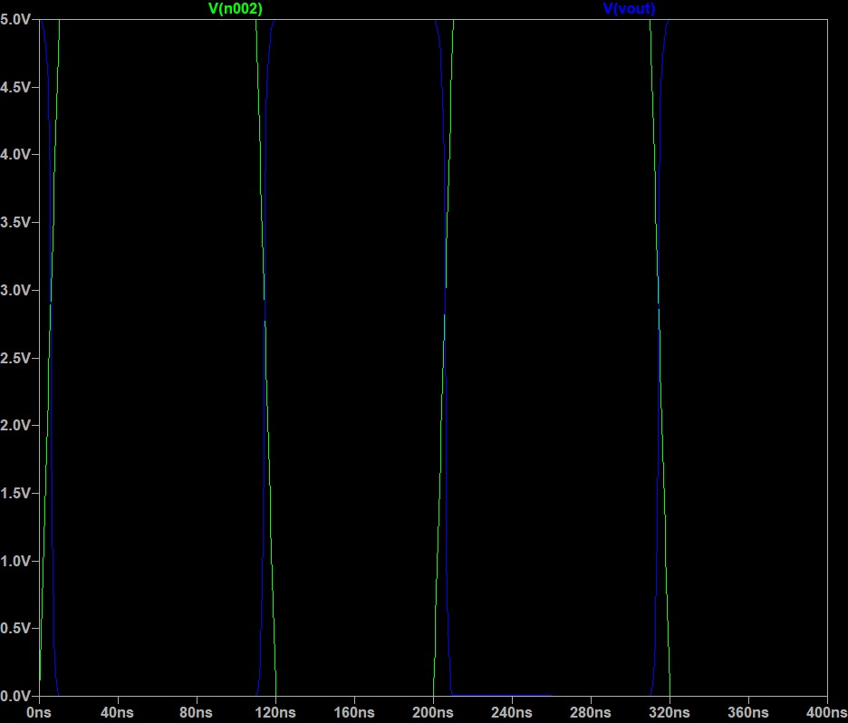
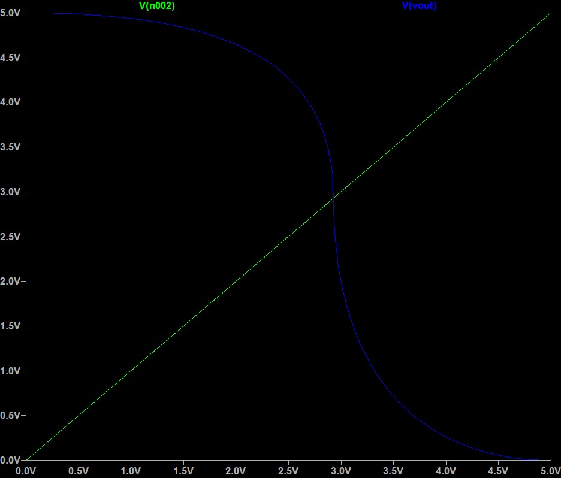

# CMOS Basics – Inverter

### 🔍 Learning Goals
- Understand CMOS inverter structure (PMOS + NMOS).
- Run transient analysis and DC sweep in LTspice.
- Compare simulated waveforms to theoretical expectations.

### 📂 Files
- `inverter.asc` → LTspice schematic
- `inverter_transient.jpg` → Transient response
- `inverter_vtc.jpg` → Voltage Transfer Characteristics

### 📊 Simulation Results
#### Transient

#### VTC

### ✅ Expected Outcome
- Output switches between 0V and VDD (rail-to-rail).
- Switching threshold ≈ VDD/2.
