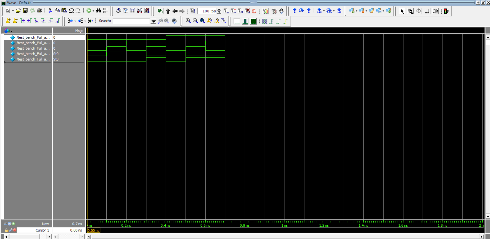

# Week 01: Half Adder and Full Adder (Hierarchical Design)

## 🎯 Learning Goals
- Review the concept of Half Adder and Full Adder.
- Practice **hierarchical design** in Verilog (building Full Adder from Half Adders).
- Simulate both designs in ModelSim (Quartus Prime flow).

## 📂 Folder Structure
- **src/** → Verilog source codes:
  - `half_adder.v` → Half Adder module
  - `full_adder.v` → Full Adder (top entity, using 2 Half Adders + OR gate)
- **README.md** → Documentation for this week.

## 📝 Tasks
1. Write Verilog code for Half Adder.
2. Build Full Adder **using two Half Adders + OR gate** (hierarchical design).
3. Simulate both designs in ModelSim.
4. Verify outputs against truth tables.

## 📊 Truth Tables

### Half Adder
| A | B | Sum | Carry |
|---|---|-----|-------|
| 0 | 0 |  0  |   0   |
| 0 | 1 |  1  |   0   |
| 1 | 0 |  1  |   0   |
| 1 | 1 |  0  |   1   |

### Full Adder (built from 2 Half Adders + OR)
| A | B | Cin | Sum | Carry |
|---|---|-----|-----|-------|
| 0 | 0 |  0  |  0  |   0   |
| 0 | 0 |  1  |  1  |   0   |
| 0 | 1 |  0  |  1  |   0   |
| 0 | 1 |  1  |  0  |   1   |
| 1 | 0 |  0  |  1  |   0   |
| 1 | 0 |  1  |  0  |   1   |
| 1 | 1 |  0  |  0  |   1   |
| 1 | 1 |  1  |  1  |   1   |

## 📊 Simulation Waveform

### Full Adder  

## ✅ Expected Outcome
- Half Adder should produce correct Sum & Carry.
- Full Adder should function correctly with hierarchical instantiation.
- Simulation waveforms must match truth tables.
- Push:
  - `src/half_adder.v`
  - `src/full_adder.v`
  - simulation screenshots
  - this README.md

